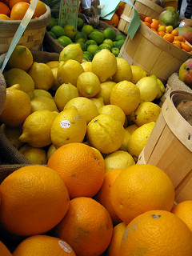

```{r setup, include=FALSE}
library(knitr)
#to work with directory structure
#possibly delete when part of overall makefile
#opts_knit$set(root.dir = "../")

#set chunk options
source("../bin/chunk-options.R")
knitr_fig_path("intro-slides")
opts_chunk$set(tidy = FALSE, results = "markup", comment = NA,
               fig.align = "center", fig.path = "fig/rmd-",
              # fig.process = fix_fig_path,
               fig.width = 8.5, fig.height = 8.5,
               fig.retina = 2)

#download data if not present
source("../setup.R")
```

## Workshop Goal

Data Carpentry’s aim is to teach researchers basic concepts, skills, and tools for working with data so that they can get more done in less time, and with less pain.

## Getting Started
Data Carpentry’s teaching is **hands-on**, so participants are encouraged to use their **own computers** to ensure the proper setup of tools for an efficient workflow.   
\
To most effectively use these materials, **please make sure to download the data and install everything before working through this lesson.**

## About the Data
The data and lessons in this workshop were originally developed through a hackathon funded by the National Ecological Observatory Network (NEON) - an NSF funded observatory in Boulder, Colorado - in collaboration with Data Carpentry, SESYNC and CYVERSE. NEON is collecting data for 30 years to help scientists understand how aquatic and terrestrial ecosystems are changing. The data used in these lessons cover two NEON field sites:  
\
Harvard Forest (HARV) - Massachusetts, USA  
San Joaquin Experimental Range (SJER) - California, USA  

## The Files
| Dataset | File name | Description |
| ---- | ------| ---- | 
| Site layout shapefiles | NEON-DS-Site-Layout-Files.zip | A set of shapefiles for the NEON's Harvard Forest field site and US and (some) state boundary layers. | 
 | Meteorological data |  NEON-DS-Met-Time-Series.zip | Precipitation, temperature and other variables collected from a flux tower at the NEON Harvard Forest site
 | Airborne remote sensing data | NEON-DS-Airborne-RemoteSensing.zip | LiDAR data collected by the NEON Airborne Observation Platform (AOP) and processed at NEON including a canopy height model, digital elevation model and digital surface model for NEON's Harvard Forest and San Joaquin Experimental Range field sites. | 
 | Landstat 7 NDVI raster data | NEON-DS-Landsat-NDVI.zip | 2011 NDVI data product derived from Landsat 7 and processed by USGS cropped to NEON's Harvard Forest and San Joaquin Experimental Range field sites | 

## Workshop Overview
| Lesson    | Overview |
| ------- | ---------- |
| [Introduction to Geospatial Concepts](http://www.datacarpentry.org/organization-geospatial/) | Understand data structures and common storage and transfer formats for spatial data. |
| [Introduction to R for Geospatial Data](http://www.datacarpentry.org/r-intro-geospatial) | Import data into R, calculate summary statistics, and create publication-quality graphics. |
| [Introduction to Geospatial Raster and Vector Data with R](http://www.datacarpentry.org/r-raster-vector-geospatial) | Open, work with, and plot vector and raster-format spatial data in R. |

## Sticky Notes
Each learner has two sticky notes - green and pink
* If you are following along well, or have completed an exercise, put the green sticky note on your laptop  
\
* If you run into a problem and need help,  put up the pink one and a helper can assist them.  
\
\

## Geospatial Overview
1. Introduction to Raster Data	
\
2. Introduction to Vector Data  
\
3. Coordinate Reference Systems   
\
4. The Geospatial Landscape  

## Rasters
Questions:  
- "What format should I use to represent my data?"
- "What are the main data types used for representing geospatial data?"
- "What are the main attributes of raster data?"  
\
Objectives:  
- "Describe the difference between raster and vector data."
- "Describe the strengths and weaknesses of storing data in raster format."
- "Distinguish between continuous and categorical raster data and identify types of datasets that would be stored in each format."  
\
Keypoints:
- "Raster data is pixelated data where each pixel is associated with a specific location."
- "Raster data always has an extent and a resolution."
- "The extent is the geographical area covered by a raster."
- "The resolution is the area covered by each pixel of a raster."

## What is a Raster
```{r load-libraries-1, results='hide', echo=FALSE, message=FALSE}
library(raster)
library(rgdal)
library(ggplot2)
```

```{r load-dsm, results = 'hide', echo = FALSE, message = FALSE}
# load data needed to generate figures
# for demonstration only - learners do not need this data for this lesson
DSM_HARV <- raster("data/NEON-DS-Airborne-Remote-Sensing/HARV/DSM/HARV_dsmCrop.tif")

# convert to a df for plotting
DSM_HARV_df <- as.data.frame(DSM_HARV, xy = TRUE)
```

{width=75%}

## Rasters with Continuous Data
```{r elevation-map, echo=FALSE}
# render DSM for tutorial content background
# for demonstration only, code not shown
ggplot() +
  geom_raster(data = DSM_HARV_df , aes(x = x, y = y, fill = HARV_dsmCrop)) +
  ggtitle("Continuous Elevation Map - NEON Harvard Forest Field Site") +
  coord_quickmap()
```

## Rasters with Categorical Data
{width=85%}

## Rasters with Categorical Data
```{r classified-elevation-map, echo=FALSE, warning=FALSE, message=FALSE}
# Load raster into R
DSM_HARV <- raster("data/NEON-DS-Airborne-Remote-Sensing/HARV/DSM/HARV_dsmCrop.tif")

# convert to a df for plotting in two steps,
# First, to a SpatialPointsDataFrame
DSM_HARV_pts <- rasterToPoints(DSM_HARV, spatial = TRUE)
# Then to a 'conventional' dataframe
DSM_HARV_df  <- data.frame(DSM_HARV_pts)

library(ggplot2)
library(dplyr)

DSM_HARV_df <- DSM_HARV_df %>%
  mutate(fct_elevation = cut(HARV_dsmCrop, 3,
                             labels = c("Low Elevation", "Middle Elevation",
                                        "High Elevation")
                             )
         )

ggplot() +
  geom_raster(data = DSM_HARV_df , aes(x = x, y = y, fill = fct_elevation)) +
  ggtitle("Classified Elevation Map - NEON Harvard Forest Field Site") +
  coord_equal()
```

## Raster Data Format for this Workshop

1. Extent  
\
2. Resolution  
\
3. Coordinate Reference System (CRS)  
\
4. Values that represent missing data (`NoDataValue`)  

## Extent of Raster Data
{width=95%}

## Raster Resolution
{width=95%}

## Multi-band Raster Data
{width=95%}

## Individual Bands
```{r demonstrate-RGB-Image, echo=FALSE}
# Use stack function to read in all bands
RGB_stack_HARV <- stack("data/NEON-DS-Airborne-Remote-Sensing/HARV/RGB_Imagery/HARV_RGB_Ortho.tif")

names(RGB_stack_HARV) <- c("Red Band", "Green Band", "Blue Band")

grayscale_colors <- gray.colors(100,
start = 0.0,
end = 1.0,
gamma = 2.2,
alpha = NULL)

# Create an RGB image from the raster stack
plot(RGB_stack_HARV,
col = grayscale_colors,
axes = FALSE)

```

## Composite Image
```{r plot-RGB-now, echo=FALSE, message=FALSE }
# Create an RGB image from the raster stack
original_par <- par() # create original par for easy reversal at end
par(col.axis = "white", col.lab = "white", tck = 0)
plotRGB(RGB_stack_HARV, r = 1, g = 2, b = 3,
axes = TRUE,
main = "3 Band Color Composite Image\n NEON Harvard Forest Field Site")
box(col = "white")

```

## Overview
1. Introduction to Raster Data	
\
2. <font color = "red">Introduction to Vector Data</font>  
\
3. Coordinate Reference Systems    
\
4. The Geospatial Landscape  

```{r setup-2, echo = FALSE, message = FALSE, warning = FALSE, results = "hide"}
# load libraries for demonstration code
library(sf)

# read in data for demonstration code
# learners do not need this data
NE.States.Boundary.US <- st_read("data/NEON-DS-Site-Layout-Files/US-Boundary-Layers/Boundary-US-State-NEast.shp")

lines_HARV <- st_read("data/NEON-DS-Site-Layout-Files/HARV/HARV_roads.shp")
point_HARV <- st_read("data/NEON-DS-Site-Layout-Files/HARV/HARVtower_UTM18N.shp")
```

## Vector Objects
Questions:  
- "What are the main attributes of vector data?"  
\
Objectives:
- "Describe the strengths and weaknesses of storing data in vector format."
- "Describe the three types of vectors and identify types of data that would be stored in each."  
\
Keypoints:
- "Vector data structures represent specific features on the Earth's surface along with attributes of those features."
- "Vector objects are either points, lines, or polygons."

## Types of Vector Objects
{width=95%}

## Exercise: Identify these Vector Types
```{r, echo = FALSE}
ggplot() +
   geom_sf(data = NE.States.Boundary.US, aes(color ="color"), 
       show.legend = "line") +
     scale_color_manual(name = "", labels = "State Boundary", 
       values = c("color" = "gray18")) +
  geom_sf(data = point_HARV, aes(shape = "shape"), color = 
     "purple") +
    scale_shape_manual(name = "", labels = "Fisher Tower", 
       values = c("shape" = 19)) +
  ggtitle("Fisher Tower location in Harvard Forest field site") + 
    theme(legend.background = element_rect(color = NA)) 
```


## Vector Data Format for this Workshop

1. Extent  
\
2. Resolution  
\
3. Coordinate Reference System (CRS)  
\
4. Values that represent missing data (`NoDataValue`)  

## Overview
1. Introduction to Raster Data	
\
2. Introduction to Vector Data  
\
3. <font color = "red">Coordinate Reference Systems</font>  
\
4. The Geospatial Landscape  

## CRS
Questions:  
* "What is a coordinate reference system and how do I interpret one?"  
\
Objectives:  
* "Name some common schemes for describing coordinate reference systems."
* "Interpret a PROJ4 coordinate reference system description."  
\
Keypoints:  
* "All geospatial datasets (raster and vector) are associated with a specific coordinate reference system."
* "A coordinate reference system includes datum, projection, and additional parameters specific to the

## Projections
{width=95%}

## Components of a CRS

CRS information has three components:

* **Datum:** A model of the shape of the earth.  
     - In this workshop, we will use the
[WGS84
datum](https://www.linz.govt.nz/data/geodetic-system/datums-projections-and-heights/geodetic-datums/world-geodetic-system-1984-wgs84)  
\
* **Projection:** A mathematical transformation of the angular measurements on a
round earth to a flat surface (i.e. paper or a computer screen).  
\
* **Additional Parameters:** e.g., center of the map. 

## A datum is the choice of fruit to use

  

[Image source](https://github.com/MicheleTobias/R-Projections-Workshop)

## A projection is how you peel your orange and then flatten the peel
  

[Image source](http://blogs.lincoln.ac.nz/gis/2017/03/29/where-on-earth-are-we/)

## A PROJ4 string includes the following

* **proj=:** the projection of the data
* **zone=:** the zone of the data (this is specific to the UTM projection)
* **datum=:** the datum use
* **units=:** the units for the coordinates of the data
* **ellps=:** the ellipsoid (how the earth's  roundness is calculated) for
the data

## UTM Zones


## Exercise: Reading a PROJ4 String
Here is a PROJ4 string for one of the datasets we will use in this workshop:  
\
`+proj=utm +zone=18 +datum=WGS84 +units=m +no_defs +ellps=WGS84 +towgs84=0,0,0`  
\
 
* What projection, zone, datum, and ellipsoid are used for this data?
* What are the units of the data?
* Using the map above, what part of the United States was this data collected from?

## Overview
1. Introduction to Raster Data	
\
2. Introduction to Vector Data  
\
3. Coordinate Reference Systems  
\
4. <font color="red">The Geospatial Landscape</font>  

## The Landscape of GIS
Questions:  
- "What programs and applications are available for working with geospatial data?"  
\
Objectives:
- "Describe the difference between various approaches to geospatial computing, and their relative strengths and weaknesses."
- "Name some commonly used GIS applications."
- "Name some commonly used R packages that can access and process spatial data."
- "Describe pros and cons for working with geospatial data using a command-line versus a graphical user interface."  
\
Keypoints:
- "Many software packages exist for working with geospatial data."
- "Command-line programs allow you to automate and reproduce your work."
- "The RStudio GUI provides a user-friendly interface for working with R."


## Benefits of using a GUI
- Tools are all laid out in front of you
- Complex commands are easy to build
- Don't need to learn a coding language
- Cartography and visualisation is more intuitive and flexible
  
## Downsides of using a GUI
- Low reproducibility - you can't record your actions and replay
- Most are not designed for batch-processing files
- Limited ability to customise functions or write your own
- Intimidating interface for new users - so many buttons!

## Today's Pacakges in R
* `sf` for working with vector data   
\
* `raster` for working with raster data  
\
* `rgdal` for an R-friendly GDAL interface