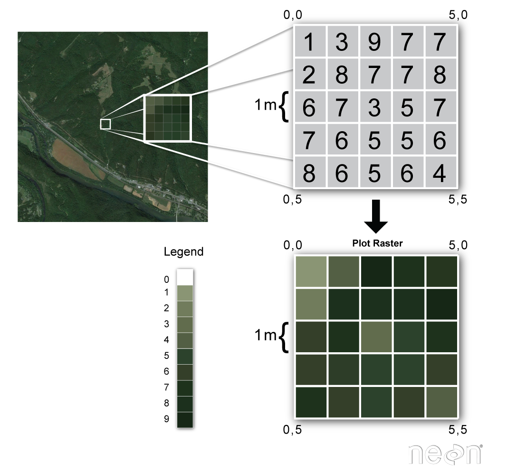

```{r, include=FALSE}
source("../bin/chunk-options.R")
source("../setup.R")
knitr_fig_path("00-")
```

This tutorial provides an overview of key spatial data concepts, including structures and common storage and transfer formats.

**Skill Level:** This tutorial provides conceptual background for the Data Carpentry
geospatial tutorial series. The concepts outlined in this tutorial relate to many 
programming languages and data types!

All of the topics below are covered in more detail in later episodes. This episode just provides enough background to help you get started. 

# Structures: Raster and Vector

## About Raster Data
Raster or "gridded" data are stored as a grid of values which are rendered on a
map as pixels. Each pixel value represents an area on the Earth's surface.

<figure>
<a href="../images/dc-spatial-raster/raster_concept.png">

</a>
<figcaption> Source: National Ecological Observatory Network (NEON)
</figcaption>
</figure>

The cell values can represent a continuous surface (e.g. elevation)
or a categorical classification (e.g. land use). If this sounds
familiar, it is because this data structure is very common: its how
we represent any digital image. A geospatial raster is only different
from a digital photo in that it is accompanied by spatial information
that connects the data to a particular location. This includes the
raster's extent and cell size, the number of rows and columns, and
its coordinate reference system (CRS, more on this later).

## Types of Data Stored in Raster Format
Raster data can be continuous or categorical. Continuous rasters can have a
range of quantitative values. Some examples of continuous rasters include:

1. Precipitation maps.
2. Maps of tree height derived from LiDAR data.
3. Elevation values for a region.

A map of elevation for Harvard Forest derived from the
<a href="http://www.neonscience.org/data-collection/airborne-remote-sensing" target="_blank">
NEON AOP LiDAR sensor</a>
is below. Elevation is represented as continuous numeric variable in this map. The legend
shows the continuous range of values in the data from around 300 to 420 meters.

```{r load-libraries-1, results='hide', echo=FALSE, message=FALSE}

library(raster)
library(rgdal)

```

```{r elevation-map, echo=FALSE}
# render DSM for tutorial content background
DSM_HARV <- raster("data/NEON-DS-Airborne-Remote-Sensing/HARV/DSM/HARV_dsmCrop.tif")

library(ggplot2)

# convert to a df for plotting in two steps,
# First, to a SpatialPointsDataFrame
DSM_HARV_pts <- rasterToPoints(DSM_HARV, spatial = TRUE)
# Then to a 'conventional' dataframe
DSM_HARV_df  <- data.frame(DSM_HARV_pts)
rm(DSM_HARV_pts)

ggplot() +
geom_raster(data = DSM_HARV_df , aes(x = x, y = y, fill = HARV_dsmCrop)) +
ggtitle("Continuous Elevation Map - NEON Harvard Forest Field Site") +
coord_equal()

```

Some rasters contain categorical data where each pixel represents a discrete
class such as a landcover type (e.g., "forest" or "grassland") rather than a
continuous value such as elevation or temperature. Some examples of classified
maps include:

1. Landcover / land-use maps.
2. Tree height maps classified as short, medium, tall trees.
3. Elevation maps classified as low, medium and high elevation.

#### Categorical Landcover Map for the United States
<figure>
<a href="http://neondataskills.org/images/spatialData/NLCD06_conus_lg.gif ">

</a>
<figcaption> Map of the United States showing landcover as categorical data.
Each color is a different landcover category.  Source:
<a href="http://www.mrlc.gov/nlcd06_data.php" target="_blank">
Multi-Resolution Land Characteristics Consortium, USGS</a>
</figcaption>
</figure>

#### Categorical Elevation Map of the NEON Harvard Forest Site
The legend of this map shows the colors representing each discrete class.

```{r classified-elevation-map, echo=FALSE, warning=FALSE, message=FALSE}

# Load raster into R
DSM_HARV <- raster("data/NEON-DS-Airborne-Remote-Sensing/HARV/DSM/HARV_dsmCrop.tif")

# convert to a df for plotting in two steps,
# First, to a SpatialPointsDataFrame
DSM_HARV_pts <- rasterToPoints(DSM_HARV, spatial = TRUE)
# Then to a 'conventional' dataframe
DSM_HARV_df  <- data.frame(DSM_HARV_pts)

library(ggplot2)
library(dplyr)

DSM_HARV_df <- DSM_HARV_df %>%
mutate(fct_elevation = cut(HARV_dsmCrop, 3,
labels = c("Low Elevation","Middle Elevation","High Elevation")
)
)

ggplot() +
geom_raster(data = DSM_HARV_df , aes(x = x, y = y, fill = fct_elevation)) +
ggtitle("Classified Elevation Map - NEON Harvard Forest Field Site") +
coord_equal()

```

Raster data has some important advantages:

* representation of continuous surfaces
* potentially very high levels of detail
* data is 'unweighted' across its extent - the geometry doesn't implicitly highlight
features (wording?? unbiased?)
* cell-by-cell calculations can be very fast and efficient

The downsides of raster data are

* very large file sizes as cell size gets smaller
* currently popular formats don't embed metadata well (more on this later!)
* can be difficult to represent complex information

Satellite imagery is probably the most complex raster representation
you will work with. Satellites like Landsat capture information at
multiple wavelengths, from both human-visible and infrared bands.
Final products are split into specific wavelength ranges, so to make
a colour image of the land surface, one may have to combine red,
green, and blue datasets.

## Extent
The spatial extent is the geographic area that the raster data covers.

<figure>
<a href="../images/dc-spatial-raster/spatial_extent.png">

</a>
<figcaption> Image Source: National Ecological Observatory Network (NEON)
</figcaption>
</figure>

The spatial extent of an R spatial object represents the geographic "edge" or
location that is the furthest north, south, east and west. In other words, `extent`
represents the overall geographic coverage of the spatial object.

## Resolution
A raster has horizontal (x and y) resolution. This resolution represents the
area on the ground that each pixel covers. The units for our data are in meters.
Given our data resolution is 1 x 1, this means that each pixel represents a
1 x 1 meter area on the ground.

<figure>
<a href="../images/dc-spatial-raster/raster_resolution.png">

</a>
<figcaption> Source: National Ecological Observatory Network (NEON)
</figcaption>
</figure>

## What is a GeoTIFF??
Raster data can come in many different formats. In this tutorial, we will use the
geotiff format which has the extension `.tif`. A `.tif` file stores metadata
or attributes about the file as embedded `tif tags`. For instance, your camera
might
store a tag that describes the make and model of the camera or the date the
photo was taken when it saves a `.tif`. A GeoTIFF is a standard `.tif` image
format with additional spatial (georeferencing) information embedded in the file
as tags. These tags can include the following raster metadata:

1. A Coordinate Reference System (`CRS`)
2. Spatial Extent (`extent`)
3. Values that represent missing data (`NoDataValue`)
4. The `resolution` of the data

In this tutorial we will discuss all of these metadata tags.

## More Resources on the  `.tif` format
>
> * <a href="https://en.wikipedia.org/wiki/GeoTIFF" target="_blank"> GeoTIFF on Wikipedia</a>
> * <a href="https://trac.osgeo.org/geotiff/" target="_blank"> OSGEO TIFF documentation</a>
{: .callout}

# Multi-band Raster Data

## The Basics of Imagery - About Spectral Remote Sensing Data

<iframe width="560" height="315" src="https://www.youtube.com/embed/3iaFzafWJQE" frameborder="0" allowfullscreen></iframe>

## About Raster Bands in R
As discussed in the
[Intro to Raster Data episode]({{ base.url }}/R/Introduction-to-Raster-Data-In-R),
a raster can contain 1 or more bands.

<figure>
<a href="{{ site.baseurl }}/images/dc-spatial-raster/single_multi_raster.png">

</a>
<figcaption>A raster can contain one or more bands. We can use the
raster function to import one single band from a single OR multi-band
raster.  Source: National Ecological Observatory Network (NEON).</figcaption>
</figure>

To work with multi-band rasters in `R`, we need to change how we import and plot
our data in several ways.

* To import multi band raster data we will use the `stack()` function.
* If our multi-band data are imagery that we wish to composite, we can use
`plotRGB()` (instead of `plot()`) to plot a 3 band raster image.

## About Multi-Band Imagery
One type of multi-band raster dataset that is familiar to many of us is a color
image. A basic color image consists of three bands: red, green, and blue. Each
band represents light reflected from the red, green or blue portions of the
electromagnetic spectrum. The pixel brightness for each band, when composited
creates the colors that we see in an image.

<figure>
<a href="{{ site.baseurl }}/images/dc-spatial-raster/RGBSTack_1.jpg">
</a>
<figcaption>A color image consists of 3 bands - red, green and blue. When
rendered together in a GIS, or even a tool like Photoshop or any other
image software, they create a color image.
Source: National Ecological Observatory Network (NEON).
</figcaption>
</figure>

We can plot each band of a multi-band image individually.

> ## Data Tip
> In many GIS applications, a single band
> would render as a single image in grayscale. We will therefore use a grayscale
> palette to render individual bands.
{: .callout}

```{r demonstrate-RGB-Image, echo=FALSE}
library(raster)
# Use stack function to read in all bands
RGB_stack_HARV <- stack("data/NEON-DS-Airborne-Remote-Sensing/HARV/RGB_Imagery/HARV_RGB_Ortho.tif")

names(RGB_stack_HARV) <- c("Red Band", "Green Band", "Blue Band")

grayscale_colors <- gray.colors(100,
start = 0.0,
end = 1.0,
gamma = 2.2,
alpha = NULL)

# Create an RGB image from the raster stack
plot(RGB_stack_HARV,
col = grayscale_colors,
axes = FALSE)

```

Or we can composite all three bands together to make a color image.

```{r plot-RGB-now, echo=FALSE, message=FALSE }
# Create an RGB image from the raster stack

original_par <- par() # create original par for easy reversal at end
par(col.axis = "white", col.lab = "white", tck = 0)
plotRGB(RGB_stack_HARV, r = 1, g = 2, b = 3,
axes = TRUE,
main = "3 Band Color Composite Image\n NEON Harvard Forest Field Site")
box(col = "white")

```

In a multi-band dataset, the rasters will always have the same *extent*,
*CRS* and *resolution*.

```{r reset-par, echo=FALSE, results="hide", warning=FALSE}
par(original_par) # go back to original par

```

## Other Types of Multi-band Raster Data

Multi-band raster data might also contain:

1. **Time series:** the same variable, over the same area, over time. Check out
[Raster Time Series Data in R ]({{site.baseurl}}/R/Raster-Times-Series-Data-In-R/)
to learn more about time series stacks.
2. **Multi or hyperspectral imagery:** image rasters that have 4 or more
(multi-spectral) or more than 10-15 (hyperspectral) bands. Check out the NEON
Data Skills
[Imaging Spectroscopy HDF5 in R ]({{site.baseurl}}/HDF5/Imaging-Spectroscopy-HDF5-In-R/)
episode for more about working with hyperspectral data cubes.


## Vector

Vector data structures aim to represent specific features on the Earth's surface, and then
assign attributes to those features. Vectors are composed of discrete geometric locations (x, y
values) known as
**vertices** that define the "shape" of the spatial object. The organization
of the vertices determines the type of vector that we are working
with: point, line or polygon.

<figure>
<a href="{{ site.baseurl }}/images/dc-spatial-vector/pnt_line_poly.png">
</a>
<figcaption> There are 3 types of vector objects: points, lines or
polygons. Each object type has a different structure.
Image Source: National Ecological Observatory Network (NEON)
</figcaption>
</figure>

* **Points:** Each individual point is defined by a single x, y coordinate.
There can be many points in a vector point file. Examples of point data include:
sampling locations, the location of individual trees or the location of plots.

* **Lines:** Lines are composed of many (at least 2) vertices, or points, that
are connected. For instance, a road or a stream may be represented by a line. This
line is composed of a series of segments, each "bend" in the road or stream
represents a vertex that has defined `x, y` location.

* **Polygons:** A polygon consists of 3 or more vertices that are connected and
"closed". Thus the outlines of plot boundaries, lakes, oceans, and states or
countries are often represented by polygons. Occasionally, a polygon can have a
hole in the middle of it (like a doughnut), this is something to be aware of but
not an issue we will deal with in this episode.

> ## Data Tip
> Sometimes, boundary layers such as
>  states and countries, are stored as lines rather than polygons. However, these
> boundaries, when represented as a line, will not create a closed object with a defined "area" that can be "filled".
{: .callout}

A point is just a single coordinate pair. A line made when at least two points are grouped
together. A polygon requires at least three points, and then a fourth point that matches the
first one, closing the loop. The points that make up lines and polygons also need to be arranged
in a sensible sequence to be valid - if you draw straight lines between each point, those lines
should never cross. Following these rules makes it possible to do complex geometric operations
by layering vector datasets together.

Vector data has some important advantages:  

  * The geometry itself contains information about what the dataset creator thought was important  
  * The geometry structures hold information in themselves - why choose point over polygon, for instance?  
  * Each geometry feature can carry multiple attributes instead of just one, e.g. a database of cities can have attributes for name, country, population, etc  
  * Data storage can be very efficient compared to rasters  
  
The downsides of vector data are  

  * potential loss of detail compared to raster  
  * potential bias in datasets - what didn't get recorded?  
  * Calculations involving multiple vector layers need to do math on the geometry as well as the attributes, so can be slow compared to raster math  

Vector datasets are in use in many industries besides geospatial. For instance, computer
graphics are largely vector-based, although the data structures in use tend to join points using
arcs and complex curves rather than straight lines. Computer-aided design (CAD) is also vector-
based. The difference is, again, that geospatial datasets are accompanied by information tying
their features to real-world locations.

## Shapefiles: Points, Lines, and Polygons
Geospatial data in vector format are often stored in a `shapefile` format.
Because the structure of points, lines, and polygons are different, each
individual shapefile can only contain one vector type (all points, all lines
or all polygons). You will not find a mixture of point, line and polygon
objects in a single shapefile.

Objects stored in a shapefile often have a set of associated `attributes` that
describe the data. For example, a line shapefile that contains the locations of
streams, might contain the associated stream name, stream "order" and other
information about each stream line object.

You can think
of this like a spreadsheet with rows and columns. Each column in the spreadsheet
is an individual **attribute** that describes an object. Shapefile attributes
include measurements that correspond to the geometry of the shapefile features.

For example, the `HARV_Roads` shapefile which we will be using in [a later lesson](https://datacarpentry.org/r-raster-vector-geospatial/07-vector-shapefile-attributes-in-r/index.html) contains an
attribute called `TYPE`. Each line in the shapefile has an associated `TYPE`
which describes the type of road (woods road, footpath, boardwalk, or
stone wall).

<figure>
    <a href="{{ site.baseurl }}/images/dc-spatial-vector/Attribute_Table.png">
    </a>
    <figcaption>The shapefile format allows us to store attributes for each
        feature (vector object) stored in the shapefile. The attribute table, is
        similar to a spreadsheet. There is a row for each feature. The first column
        contains the unique ID of the feature. We can add additional columns that
        describe the feature. Image Source: National Ecological Observatory Network
        (NEON)
    </figcaption>
</figure>


* More about shapefiles can found on
<a href="https://en.wikipedia.org/wiki/Shapefile" target="_blank">Wikipedia</a>.

## Coordinate Reference Systems

A data structure cannot be considered geospatial unless it is
accompanied by coordinate reference system (CRS) information, in
a format that geospatial applications can use to display and
manipulate the data correctly. CRS information connects data to the
Earth's surface using a mathematical model.

> ## CRS vs SRS
>
> 'CRS' ('coordinate reference system') and 'SRS' ('spatial reference system') are synonyms and are commonly interchanged.
{: .callout}

The Coordinate Reference System or `CRS` tells your mapping software (for example `R`)
where the raster is located
in geographic space. It also tells the mapping software what method should be used to "flatten"
or project the raster in geographic space.

<figure>
<a href="https://media.opennews.org/cache/06/37/0637aa2541b31f526ad44f7cb2db7b6c.jpg">

</a>

<figcaption> Maps of the United States in different projections. Notice the
differences in shape associated with each different projection. These
differences are a direct result of the calculations used to "flatten" the
data onto a 2-dimensional map. Source: opennews.org</figcaption>
</figure>

### What Makes Spatial Data Line Up On A Map?
There are lots of great resources that describe coordinate reference systems and
projections in greater detail (read more, below). For the purposes of this
activity, what is important to understand is that data from the same location
but saved in **different projections will not line up in any GIS or other
program**. Thus, it's important when working with spatial data in a program like
`R` to identify the coordinate reference system applied to the data and retain
it throughout data processing and analysis.

> ## More Resources on CRS
>
> * <a href="http://spatialreference.org/ref/epsg/" target="_blank"> A comprehensive online library of CRS information.</a>
> * <a href="https://docs.qgis.org/2.18/en/docs/gentle_gis_introduction/coordinate_reference_systems.html" target="_blank">QGIS Documentation - CRS Overview.</a>
> * <a href="https://source.opennews.org/en-US/learning/choosing-right-map-projection/" target="_blank">Choosing the Right Map Projection.</a>
> * <a href="https://www.nceas.ucsb.edu/~frazier/RSpatialGuides/OverviewCoordinateReferenceSystems.pdf" target="_blank"> NCEAS Overview of CRS in R.</a>
> * Check out this short video highlighting how map projections can make continents
seems proportionally larger or smaller than they actually are!
> <iframe width="560" height="315" src="https://www.youtube.com/embed/KUF_Ckv8HbE" frameborder="0" allowfullscreen></iframe>
{: .callout}

CRS information has three components:

CRS = Datum + Projection + Additional Parameters

A common analogy employed to teach projections is the orange peel analogy. If you imagine that the earth is an orange, how you peel it and then flatten the peel is similar to how projections get made. We will also use it here.  

### Datum  

A Datum is a model of the shape of the earth. It has angular units (i.e. degrees) and
defines the starting point (i.e. where is (0,0)?) so the angles reference a
meaningful spot on the earth. Common global datums are WGS84 and NAD83. Datums can
also be local, fit to a particular area of the globe, but ill-fitting outside the
area of intended use.

When datums are used by themselves they are called a Geographic Coordinate System.  

> ## Orange Peel Analogy
> A datum is the choice of fruit to use. Is the earth an orange, a lemon, a lime, a grapefruit?
>
> ```{r, echo=FALSE, fig.caption="Image of citrus"}
> knitr::include_graphics("../fig/citrus.jpg")
> ```
>
> Image source: [https://github.com/MicheleTobias/R-Projections-Workshop](https://github.com/MicheleTobias/R-Projections-Workshop)
{: .discussion}

### Projection  

A Projection is a mathematical transformation of the angular measurements on a round earth to a flat surface (i.e. paper or a computer screen).  

The units associated with a given projection are usually linear (feet, meters, etc.).  

Many people use the term "projection" when they actually mean "coordinate reference system".   


> ## Orange Peel Analogy
> A projection is how you peel your orange and then flatten the peel.
>
> ```{r, echo=FALSE, fig.caption="Image of peeled orange with globe"}
> knitr::include_graphics("../fig/orange-peel-earth.jpg")
> ```
> Image source: [http://blogs.lincoln.ac.nz/gis/2017/03/29/where-on-earth-are-we/](http://blogs.lincoln.ac.nz/gis/2017/03/29/where-on-earth-are-we/)
{: .discussion}

Image source: [http://blogs.lincoln.ac.nz/gis/2017/03/29/where-on-earth-are-we/](http://blogs.lincoln.ac.nz/gis/2017/03/29/where-on-earth-are-we/)

### Additional Parameters  

Additional parameters are often necessary to create the full coordinate reference system. For example, one common additional parameter is a definition of the center of the map. The number of required additional parameters depends on what is needed by each specific projection.  

> ## Orange Peel Analogy
> An additional parameter could include a definition of the location of the stem of the fruit. What other parameters could be included in this analogy?
{: .discussion}


### Which CRS/projection should I use?

To decide if a projection is right for your data, answer these questions:  

  *  What is the area of minimal distortion?  
  *  What aspect of the data does it preserve?  

[University of Colorado's Map Projections](https://www.colorado.edu/geography/gcraft/notes/mapproj/mapproj_f.html) and the [Department of Geo-Information Processing](http://kartoweb.itc.nl/geometrics/map%20projections/mappro.html) has a good discussion of these aspects of projections. Online tools like [Projection Wizard](http://projectionwizard.org/) can also help you discover projections that might be a good fit for your data.  

> ## Comments from the pros 
>
> Take the time to figure identify a projection that is suited for your project.
> You don't have to stick to the ones that are popular.
{: .callout}

### Describing Coordinate Reference Systems  

There are several common systems in use for storing and transmitting CRS information, as well as translating between different CRSs. These systems generally comply with ISO 19111. EPSG, PROJ, and OGC WKT are the most common. They aren't usually used on their own, but are built in to geospatial software.

#### EPSG  

The [EPSG system](http://www.epsg.org) is a database of CRS information maintained by the International Association of Oil and Gas Producers. The dataset contains both CRS definitions and information on how to safely convert data from one CRS to another. Using EPSG is easy as every CRS has a integer identifier, e.g. WGS84 is EPSG:4326. The downside is that you can only use the CRSs EPSG defines and cannot customise them.  

Detailed information on the structure of the EPSG dataset is [available here](http://www.epsg.org/GuidanceNotes).

#### PROJ

[PROJ](http://proj4.org/) is an open-source library for storing, representing and transforming CRS information. PROJ.5 has been recently released, but PROJ.4 was in use for 25 years so you will still mostly see PROJ referred to as PROJ.4. 

PROJ represents CRS information as a text string of key-value pairs, which makes it easy to customise (and with a little practice, easy to read and interpret). 

#### OGC Well-known text (WKT)

The OGC WKT standard is used by a number of important geospatial apps and software libraries. WKT is a nested list of geodetic parameters. The structure of the information is [defined here](http://www.opengeospatial.org/standards/wkt-crs). WKT is valuable in that the CRS information is more transparent than in EPSG, but can be more difficult to read and compare than PROJ. Additionally, the WKT standard is implemented inconsistently across various software platforms, and the spec itself has some known issues ([more information here](http://gdal.org/wktproblems.html)).

#### Translating between CRS systems

CRS information can generally be translated between EPSG, PROJ and WKT representations without too much trouble, but some mistranslations are possible, especially with obscure projections. For convenience, the website [spatialreference.org](http://spatialreference.org/) holds descriptions of many common projections data in several formats. Users should that the site does not appear to be actively maintained at present, with the last update made in 2013. The GDAL library (more on this in Lesson 3) has a function called [gdalsrsinfo](http://www.gdal.org/gdalsrsinfo.html) that will report a file's CRS information in the format of your choice.

## Metadata  

Spatial data is useless without metadata. Essential metadata is, of course, the CRS information, but proper spatial metadata encompasses more than that. History and provenance of a dataset (how it was made), who is in charge of maintaining it, and appropriate (and inappropriate!) use cases should also be documented in metadata. This information should accompany a spatial dataset wherever it goes. 

In practice this can be difficult, as many spatial data formats don't have a built-in place to hold this kind of information. Metadata often has to be stored in a companion file, generated and maintained manually. 

*** 

## Common storage formats  

### Raster  

Many geospatial raster formats are just existing image formats with an extended definition that allows CRS information to be embedded in the file. GeoTIFF is one of the most common of these, along with MrSID, JPEG2000 and IMG. Other formats are ASCII-based (GRD, XYZ, ASC), with a few rows of plain-text header information followed by cell values arranged in rows and columns. These are often less useful due to their inefficient storage. More robust, but more complicated formats like NetCDF are available, but not commonly used outside of research. Other formats are industry-specific, like GRIB for meteorology. 

### Vector  

Many vector file formats (particularly ESRI SHP and MapInfo TAB) are really several interrelated files on disk - one holding a table of attributes, usually in DBF format, one holding related geometric data, and various index and header files. This can make them difficult to move around without placing them in an archive format like zip. Despite this and several other problems, the Shapefile (SHP) is still the most commonly used vector data format. 

GeoPackage is an SQLite database with an extended definition that allows spatial data storage. It has the advantage of being a single file on disk, along with stronger internal rules around data and encoding. 

XML and JSON-style formats for vector spatial data also exist, notably KML (popularised in Google Earth) and GeoJSON. These formats are commonly used by software developers for delivering geospatial data over web services. They have the advantage of being streamable (you don't need to download and open a whole file, you can just access part of it), but like any plain-text format, file size becomes very large very quickly. GeoJSON also only supports the WGS84 coordinate reference system. 

### Why not both?  

Very few formats can contain both raster and vector data - in fact, most are even more restrictive than that. Vector datasets are usually locked to one geometry type, e.g. points only. Raster datasets can usually only encode one data type, for example you can't have a multiband GeoTIFF where one layer is integer data and another is floating-point. 

There are sound reasons for this - format standards are easier to define and maintain, and so is metadata. The effects of particular data manipulations are more predictable if you are confident that all of your input data has the same characteristics. Even so, some limited support for mixed vector geometries is available in R's `sf` package, and mixed raster datatypes in `raster`. Such objects can only be saved in R's native object storage format, RDS, and should be used with caution. 

### Format interoperability  

Many existing file formats were invented by GIS software developers, often in a closed-source environment. This led to the large number of formats on offer today, and considerable problems transferring data between software environments. Some companies have built their own file translation capabilities into their software, but maintaining this capability takes a lot of work. The [Geospatial Data Abstraction Library](http://www.gdal.org/) (GDAL) is an open-source answer to this issue. 

GDAL is a set of software tools that translate between almost any geospatial format in common use today (and some not so common ones). GDAL also contains tools for editing and manipulating both raster and vector files, including reprojecting data to different CRSs. GDAL can be used as a standalone command-line tool, or built in to other GIS software. Several open-source GIS programs use GDAL for all file import/export operations. 

***
